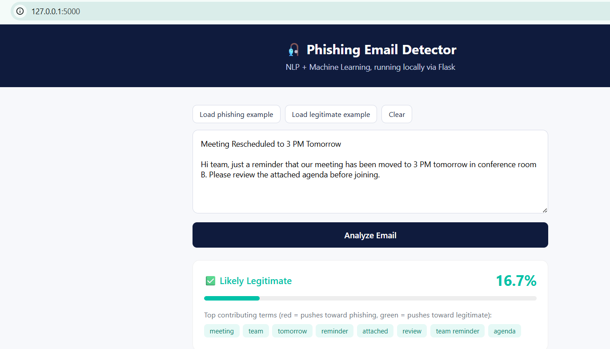
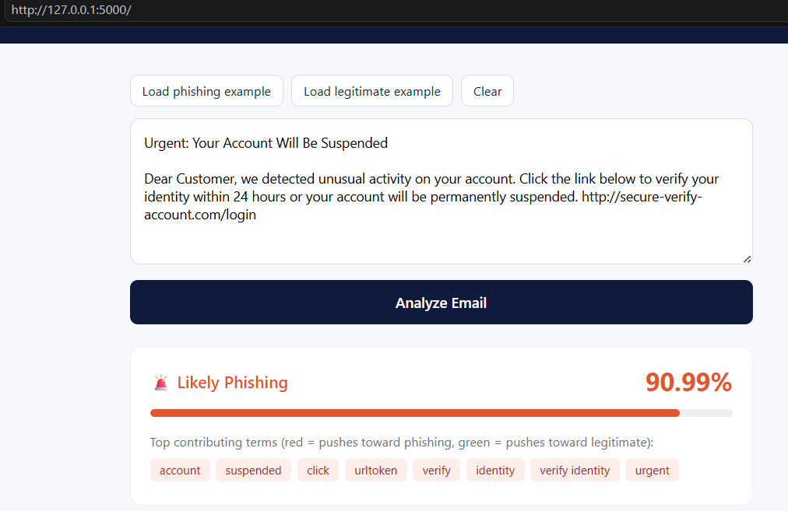

# 🔐 AI-Driven Phishing Email Detection

An AI-based phishing email detection system that analyzes email content and classifies it as **Phishing** or **Legitimate**. The project demonstrates the practical application of Artificial Intelligence and Machine Learning in cybersecurity.

## 📌 Project Overview

Phishing emails are designed to trick users into revealing sensitive information such as passwords, banking details, or personal data. Since attackers frequently change the wording and format of phishing emails, detecting them can be challenging.

This project aims to provide an additional layer of protection by analyzing email content and identifying patterns commonly associated with phishing messages.

## 🎯 Objectives

- Detect potentially phishing emails.
- Classify emails as **Phishing** or **Legitimate**.
- Provide a confidence score for predictions.
- Demonstrate the application of AI in cybersecurity.
- Develop a simple and user-friendly detection prototype.

## 🛠️ Technologies Used

- **Python** – Project implementation
- **Pandas** – Dataset handling and analysis
- **NumPy** – Numerical operations
- **Scikit-learn** – Machine learning and classification
- **NLP/Text Processing** – Processing email content
- **Flask** – Web-based prototype interface
- **Jupyter Notebook / Google Colab** – Development and testing

## 🔄 System Workflow

```text
Email Input
     ↓
Data Processing
     ↓
Text Analysis
     ↓
AI/ML Classification
     ↓
Prediction
     ↓
Phishing / Legitimate

## 🖼️ Project Screenshots

### Legitimate Email Detection



### Phishing Email Detection


